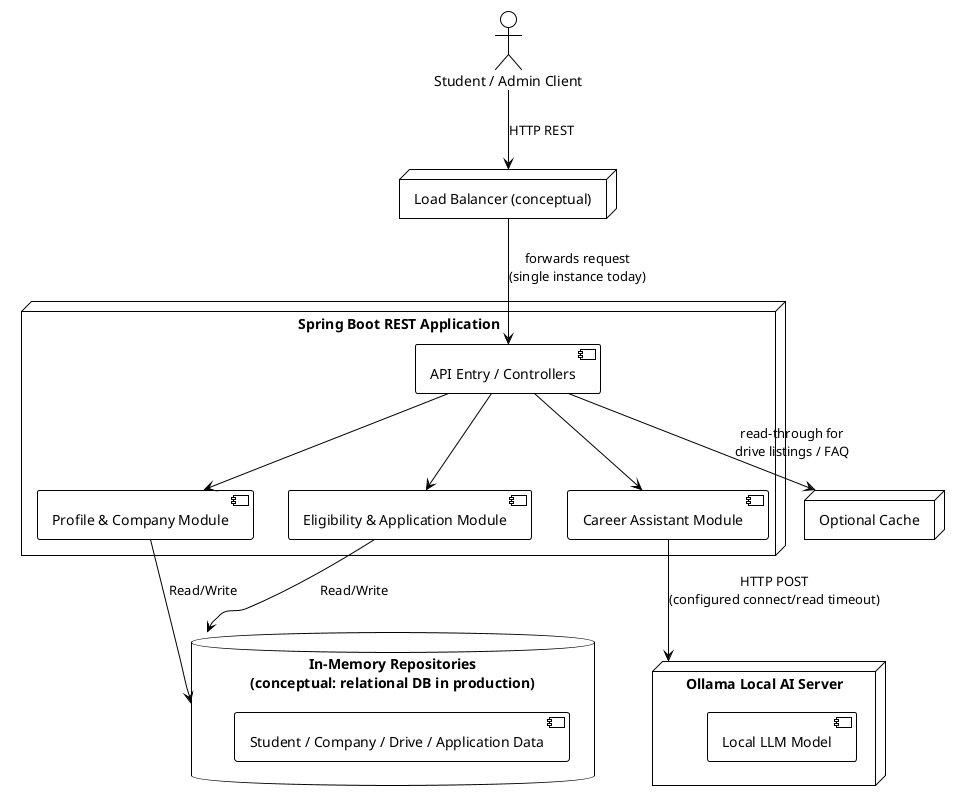

# High-Level Design (HLD)

Required per section 6 of the problem statement: a basic architecture diagram
plus a decision on each of the 8 system-design questions in section 6.2
(Scalability, Load Balancing, Availability, Consistency, Caching, SQL vs
NoSQL, Partitioning, CAP Trade-off).

## Architecture Diagram

The load balancer is drawn as a conceptual node: the prototype runs a single
Spring Boot instance (section 2.5, assumption 2), so nothing currently sits
in front of it, but the diagram shows where one would be introduced if a
second instance were deployed.

## Basic System-Design Decisions

* **Scalability.** The application is a modular monolith with stateless
  controllers/services (no session state, no server-side data outside the
  repositories). Read-heavy, low-consistency-risk endpoints — `GET
  /api/drives`, `GET /api/companies`, and the chatbot's general-FAQ path —
  are the best candidates to scale horizontally first, since duplicate
  reads carry no correctness risk. Write-heavy, invariant-sensitive
  endpoints (`POST .../applications`, `PATCH .../status`) would need a
  shared datastore before they could safely run across multiple instances,
  since today's `ConcurrentHashMap` repositories are only safe for a single
  JVM.

* **Load Balancing.** A load balancer would sit between the client and the
  Spring Boot instances (see the `Load Balancer (conceptual)` node above),
  distributing requests round-robin/least-connections across identical
  stateless instances. Because there is no in-memory session affinity
  requirement (no HTTP sessions are used), any instance can serve any
  request — the only blocker to actually running >1 instance today is that
  the in-memory repositories are per-JVM and would need to move to a shared
  store first (see SQL vs NoSQL below).

* **Availability.** Core placement APIs (students, companies, drives,
  eligibility, applications) have zero runtime dependency on Ollama.
  `NFR-05` is enforced in code: `ollama_ChatClient` is the only class that
  talks to Ollama, and its failures are caught and mapped to a `503` on
  `/api/chat` alone — every other endpoint keeps working even if Ollama is
  fully offline.

* **Consistency.** Application creation, duplicate-application prevention,
  and status transitions are treated as **CP** (consistency over
  availability): they run synchronously against the repository inside a
  single request so two racing requests cannot both create an application
  for the same student+drive or push a status through an invalid
  transition. FAQ/chatbot responses and drive listings are treated as
  **AP-tolerant**: a slightly stale drive list or a cached FAQ answer causes
  no business-rule violation, so they can favor availability/latency over
  strict freshness.

* **Caching.** The safest cache candidate is the drive listing
  (`GET /api/drives`) and static/general FAQ chatbot answers, since neither
  affects an invariant. Suggested rule: cache drive listings keyed by the
  filter query string, with a short TTL (e.g. 60s) or explicit invalidation
  on `POST /api/drives`; cache FAQ-only chatbot answers (no `studentId`
  supplied) by normalized question text with a longer TTL (e.g. 1 hour),
  since they don't depend on any student-specific or time-sensitive data.
  Eligibility results and application data are never cached, since they
  must always reflect the latest CGPA/backlog/deadline/status.

* **SQL vs NoSQL.** A relational database (e.g. PostgreSQL/MySQL) is the
  better production fit. The domain has clear relational structure with
  foreign keys and integrity constraints that map naturally to a schema —
  `Application` references exactly one `Student` and one `PlacementDrive`,
  `PlacementDrive` references exactly one `Company`, and invariants like
  "no duplicate application per student+drive" or "valid status transition
  only" are far easier to enforce (unique constraints, foreign keys,
  transactions) in a relational engine than in a schemaless store. A NoSQL
  document store would only make sense if the system later needed to scale
  reads across millions of loosely-structured records with no cross-entity
  consistency requirements, which isn't the case here.

* **Partitioning.** A likely future partition key is **graduation year**
  (or academic year/batch) for the `Student` and `Application` tables,
  since placement activity is naturally scoped to a batch and most queries
  ("students in this graduating batch", "applications for this year's
  drives") would stay within one partition. Risk: a **hot partition**
  around the current/final-year batch, since almost all active read and
  write traffic (applications, eligibility checks) concentrates on
  whichever graduation year is currently placing, while older batches'
  partitions go cold — this would need monitoring and, if it became a
  bottleneck, a secondary key (e.g. graduation year + drive ID hash) to
  spread the hot batch's load further.

* **CAP Trade-off.** One **CP-like** operation: submitting an application
  (`POST /api/drives/{driveId}/applications`) — it must never allow two
  duplicate applications to be created even under concurrent requests, so
  it favors consistency and will reject/retry rather than risk an
  inconsistent write. One **AP-like / read-tolerant** operation: listing
  placement drives (`GET /api/drives`) — if a brand-new drive takes a few
  extra seconds to show up on every replica during a network partition,
  that's an acceptable trade-off for keeping the read path fast and
  available.
