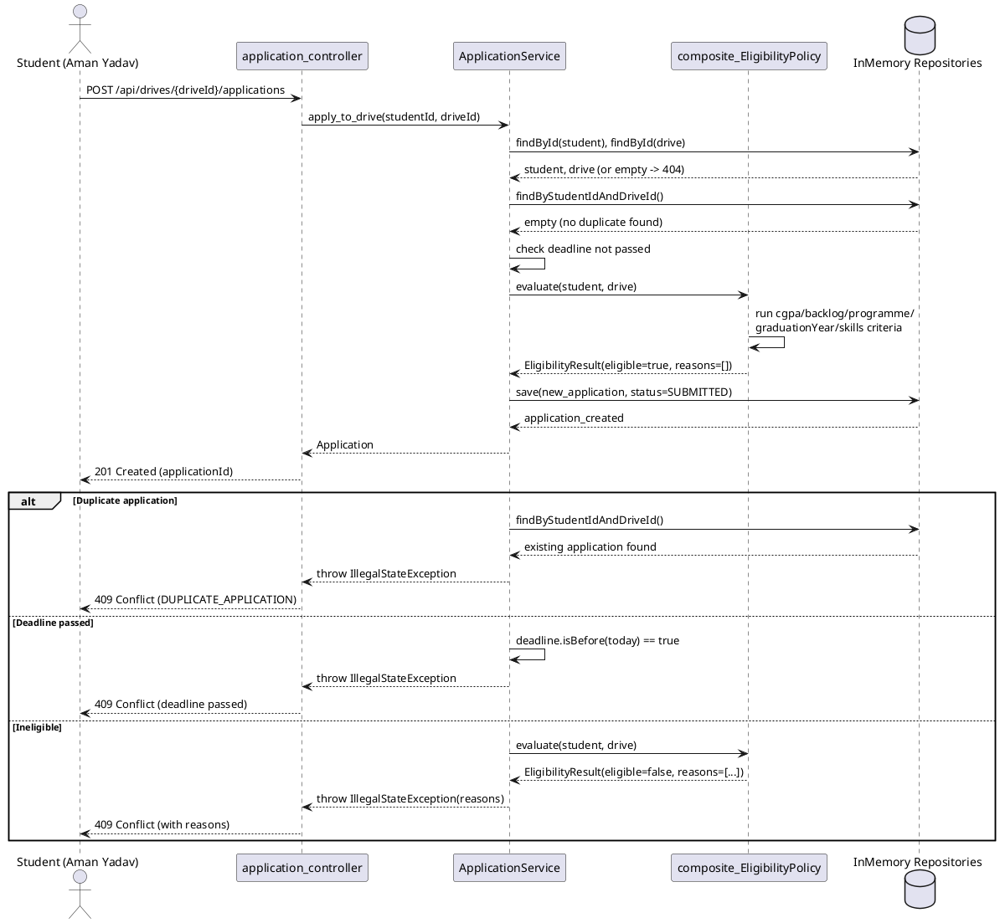
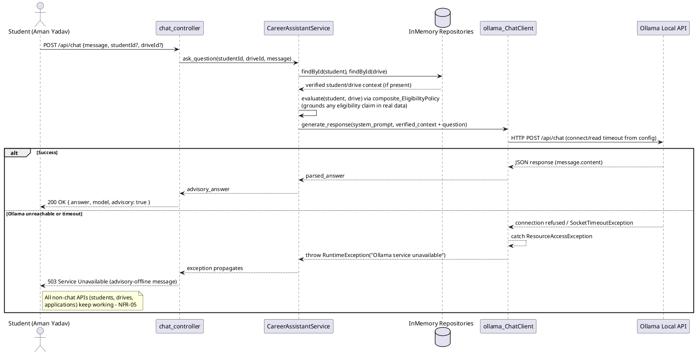

# Sequence Diagram 1: Student Applies to Drive

Maps the normal flow and every alternate/conflict path (section 5.1 requires
both success and conflict/eligibility decision paths to be visible).

# Sequence Diagram 2: Ask AI Assistant

Maps the normal flow plus the timeout/failure path required by section 5.1.

